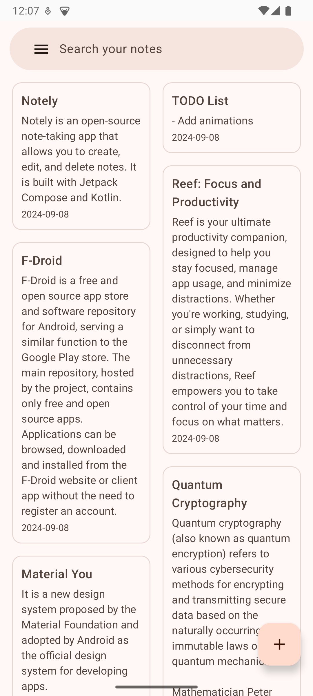
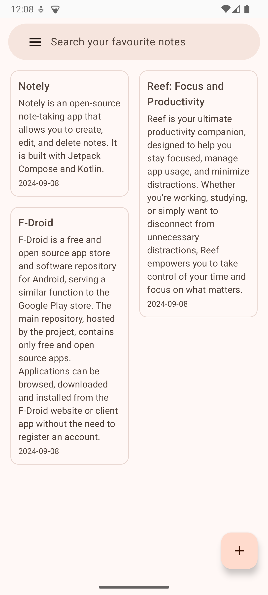
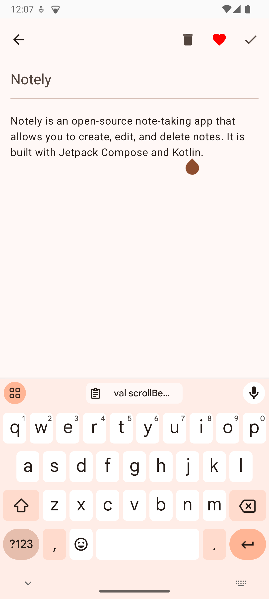
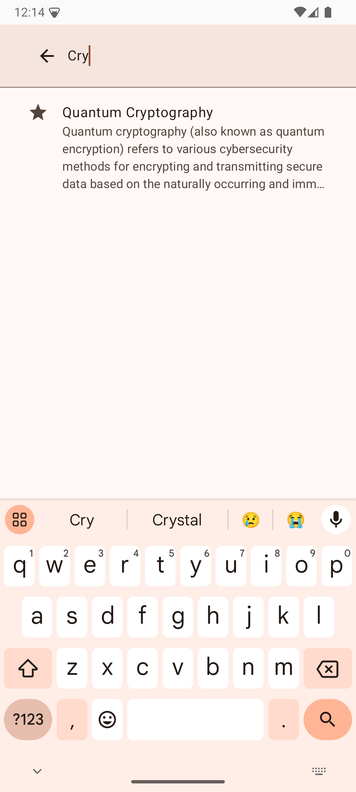

# Notely

Notely is an open-source note-taking app that allows you to create, edit, and delete notes. It is
built with Jetpack Compose and Kotlin.

It aims to create an open-source replacement for proprietary note-taking apps like Google Keep,
Evernote, and Microsoft OneNote.
The UI is heavily inspired by Google Keep.

Notely is a work in progress and is not yet feature-complete. It still lacks some functionalities of
the proprietary note-taking apps.

It was created as a learning project to explore Jetpack Compose and the modern Android development
ecosystem.

## Features

- Create, edit, and delete notes
- Favourite notes
- Search notes
- Material design
- Dark mode

## Screenshots

